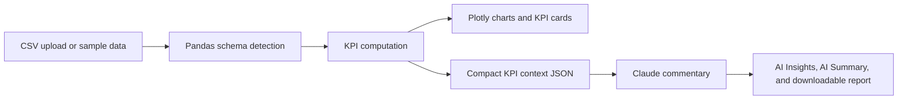

# Five-Slide Summary Deck Outline

## 1. Problem Understanding and Objective

- Operations leaders manually review dashboards and write weekly KPI summaries.
- Objective: automate the workflow from structured data to KPI visualization to plain-English insight.
- Success criteria: accurate KPI computation, clear trends, and commentary that helps leadership decide what to inspect next.

Suggested visual: screenshot of the dashboard top section with KPI cards.

## 2. Solution Architecture and Design Flow

- Streamlit handles the app shell, upload flow, filters, and presentation.
- Pandas computes monthly KPI trends.
- The LLM receives only recent KPI context, not the full raw dataset.
- Fallback commentary keeps the demo reliable when no API key is available.

## 3. Implementation Highlights

- `kpi_logic.py`: detects column names, aggregates monthly data, computes revenue, orders, profit, and profit margin.
- `ai_commentary.py`: centralizes the prompt, provider calls, JSON parsing, and fallback insights.
- `app.py`: renders KPI cards, drill-down filters, Plotly charts, AI Insights, AI Summary, and export button.
- API keys are read from environment variables, so no secret is exposed in the UI or repository.

Suggested visual: code snippet of the prompt rules plus a chart screenshot.

## 4. Challenges and Learnings

- Tradeoff: Streamlit was chosen over a React/FastAPI build to maximize reliability within a five-day window.
- Schema detection needs to be flexible enough for public datasets while still producing trustworthy KPI math.
- LLM commentary must be constrained to the data to avoid unsupported causal claims.
- Caching and fallback narratives are important for repeatable demos.

## 5. Demo Summary and Next Steps

- Demo flow: load demo CSV, review KPI cards, filter by region/product line, inspect trends, generate AI Insights and AI Summary, download report.
- Next enhancements:
  - Forecast commentary for the next quarter
  - Anomaly detection using scikit-learn or robust statistical thresholds
  - PDF/email report export
  - Google Sheets connector
  - React/FastAPI front end if the prototype becomes a production product
